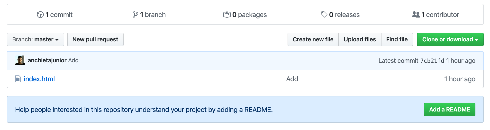

Não sabe por onde começar e pra que server o Git e o Github? Leia esse post até o fim e publique seus primeiros códigos na maior plataforma de desenvolvedores do mundo.

## Versionamento de software

Nesse [artigo](https://medium.com/@anchietajunior/introdu%C3%A7%C3%A3o-a-versionamento-de-projetos-com-git-e-github-a8de8f7eefa8) escrito por mim em 2015 eu tento explicar de uma forma não técnica a principal usabilidade do Git e Github, mas primeiro, é importante entender ao menos por cima o que é versionamento de software.

Segundo o site Devmedia:

***"Sistemas de controle de versões são ferramentas de apoio aos desenvolvedores cuja principal função é controlar as modificações realizadas em um arquivo de projeto. Ainda possuem um mecanismo automatizado para identificar e controlar as modificações realizadas nos arquivos de um projeto ao longo do tempo, garantindo integridade e rastreabilidade das modificações. O controle de versões é visto como uma extensão natural do processo de desenvolvimento, permitindo que se possam realizar modificações paralelas e de forma coerente e padronizada, especialmente se tratando de equipes geograficamente dispersas. "***

Seguindo este conceito, vamos supor que temos um projeto com 3 contribuintes ou desenvolvedores:

- João — Desenvolvedor Java Australiano.
- Filipe — Desenvolvedor Front-End Brasileiro.
- Maria — Desenvolvedora Javascript da Inglaterra.

Seria praticamente impossível manter o fluxo de entrega de funcionalidades sem um controle de versão.

Como Maria poderia testar suas implementações em Javascript utilizando o 
Back-end desenvolvido por João e como Filipe traria os dados tratados pelas implementações dos outros dois desenvolvedores para exibir aos usuários ?

Através de um projeto no qual o código esteja versionado, facilmente cada um dos três desenvolvedores poderiam baixar o código fonte publicado pelos outros dois e trabalhar normalmente em suas atividades, sabendo que a sincronia poderá ser feita facilmente baseando-se uma ferramenta que traz segurança e conforto aos membros do projeto.

## Git

O site [Tableless](http://tableless.com.br/tudo-que-voce-queria-saber-sobre-git-e-github-mas-tinha-vergonha-de-perguntar/) cita que:

***"o Git é um sistema de controle de versão de arquivos. Através deles podemos desenvolver projetos na qual diversas pessoas podem contribuir simultaneamente no mesmo, editando e criando novos arquivos e permitindo que os mesmos possam existir sem o risco de suas alterações serem sobrescritas."***

O git foi criado por volta de 2005 por ninguém menos que Linus Torvalds, criador do Linux, núcleo do GNU/Linux e tem como uma de suas maiores vantagens a facilidade de criação e manuseio de ramificações (Branch) do projeto. O conceito de Branch pode ser tratado em uma publicação futura, devido aos detalhes e importância dentro dos conceitos do Git.

## Github

O mesmo site [Tableless](http://tableless.com.br/tudo-que-voce-queria-saber-sobre-git-e-github-mas-tinha-vergonha-de-perguntar/) ainda cita que o Github "é um serviço web que oferece diversas funcionalidades extras aplicadas ao git. Resumindo, você poderá usar gratuitamente o github para hospedar seus projetos pessoais. Além disso, quase todos os projetos/frameworks/bibliotecas sobre desenvolvimento open source estão no github, e você pode acompanhá-los através de novas versões, contribuir informando bugs ou até mesmo enviando código e correções. Se você é desenvolvedor e ainda não tem github, você está atrasado e essa é a hora de correr atrás do prejuízo."
Depois dessa descrição, fica até difícil procurar algo mais a dizer. :D


## Conclusão da parte teórica

Versionamento é indispensável, alunos e profissionais da área de desenvolvimento que não utilizam ferramentas de versão de software acabam ficando pra trás no mercado. Por isso é importante buscar conhecimento e se aprofundar em versionamento. O Git e o Github proporcionam uma experiência fácil e grátis para iniciar nesse novo mundo mágico de trabalho em equipes e fluxos para manter o código fonte de um projeto atualizado.

Quem quiser iniciar, pode ver este link explicando a instalação do Git,. Crie sua conta no Github e veja um pouco mais desses conceitos de branch. Pode iniciar com uma coisa pequena, um arquivo Readme.md para exemplificação do projeto e alguns arquivos css, html, javascript ou de qualquer linguagem que lhe agrade, o importante é começar no mundo Open Source.

## Criando uma conta no Github

Antes de mais nada, aconselho a criar uma [conta no Github](https://github.com/) caso ainda não possua.

## Instalando o Git

O Git está disponível para os sistemas operacionais mais utilizados como Windows, Linux e MacOs, no meu caso.

### Windows

Instale no Windows utilizando [este link](https://gitforwindows.org/).

### MacOS 

Instale no Mac utilizando o comando:

```sh
brew install git
```

### Linux

Instale no Linux utilizando o comando:

```sh
sudo apt-get install git
```

Quando concluir a instalação, você pode já definir algumas configurações para o git na sua máquina:

```sh
git config --global user.name "Seu nome"
git config --global user.email "Seu email"
```

Não esqueça de alterar os comandos acima com o seu nome e seu e-mail utilizados no Github.

## Comandos básicos no terminal

Caso esteja tudo ok com a instalação do seu Git, já podemos executar alguns comandos. Existem algumas ferramentas visuais, até o próprio VSCode já possui uma integração por padrão com o Git e não tem nenhum problema em utiliza-lo para isso, porém, sempre aconselho iniciar pelo terminal pra entender melhor os comandos e o que se passa por trás da ferramenta visual.

Para começar, peço que crie uma pasta em qualquer local da sua máquina, crie um arquivo chamado ***index.html*** dentro dessa pasta e acesse essa pasta pelo seu terminal, passa isso você pode usar os seguintes comandos:

### Navegar em pastas pelo terminal (cd ou Change Directory)

O comando ***cd*** ou Change Directory serve para conseguirmos navegar pelas pastas do nosso sistema através do terminal, veja alguns exemplos:

- Entrar na pasta documentos
- Voltar uma pasta
- Voltar duas pastas
- Ir para a pasta Home do sistema

```sh
cd Documents 
cd ..
cd ../..
cd ~
```

Então, supondo que você já tenha navegado até a pasta do seu projeto, podemos dar continuidade e conhecer outro comando, dessa vez para criar arquivos.

```sh
cd Documents/meu-projeto
```

### Criando arquivos com o comando Touch

Agora podemos criar o nosso primeiro arquivo chamado ***index.html***, execute o seguinte comando:

```sh
touch index.html
```

### Listando o conteúdo de uma pasta

Caso tenha ficado em dúvida se de fato o arquivo ***index.html*** foi criado, você pode listar o conteúdo de uma pasta utilizando o comando ***ls***.

```sh
ls

> index.html
```

Se esse foi o resultado, então seu arquivo foi criado com sucesso via terminal. Agora você pode adicionar algum conteúdo ao seu arquivo:

```html
<html>
<head>
  <title>Meu arquivo</title>
</head>
<body>
  <h1>Meu projeto</h1>
</body>
</html>
```

### Resumindo

Esses foram os comandos do terminal que vimos até agora, lembrando que esses comandos em sua maioria funcionam no MacOS e no Linux.

- cd - Navegar entre pastas
- touch - Criar arquivos
- ls - Listar conteúdo de pastas

## Iniciado projeto Git

Para iniciar um projeto git em uma pasta existente (o nosso caso), dentro da pasta do nosso projeto utilizamos o comando:

```sh
git init
```

Uma mensagem deve aparecer no seu terminal com a mensagem:

```sh
Initialized empty Git repository in /Users/seu-usuario/Documents/meu-projeto/.git/
```

E no terminal deve aparecer a palavra ***master***, isso significa que temos o nosso primeiro branch (ramificação) do projeto.

## Status

Sempre que não tiver certeza sobre o estado atual dos arquivos do seu projeto, faça uso do comando:

```sh
git status
```

Caso tenha seguido o tutorial completo, deve aparecer uma referência do arquivo ***index.html*** no terminal com a cor vermelha, indicando que o arquivo ainda não foi rastreado.

## Rastreando arquivos

Sempre que um arquivo for criado ou modificado, é preciso rastrea-lo para fazer parte do branch no qual estamos trabalhando. Dessa forma, podemos rastrear arquivos utilizando o comando ***add***.

Podemos rastrear arquivos específicos:

```sh
git add index.html
```

Ou podemos rastrear tudo de uma vez só, por exemplo, um arquivo ***index.html***, um arquivo ***estilos.css***, um outro arquivo chamado ***app.js*** e por ai vai, executando dessa forma:

```sh
git add .
```

Executando o comando ***git status*** novamente, agora veja que ele aparece na cor verde, ou seja, esse arquvivo já foi rastreado pelo git e está pronto para ser ***commitado***.

## Commitando (Confirmando) alterações

O ato de commitar algo dentro de um projeto, significa confirmar a criação ou alteração de algum arquivo no nosso código. Por exemplo, nesse momento apenas adicionamos um arquivo ***index.html*** com um conteúdo inicial, sempre procuro descrever os commits com o propósito do mesmo, por exemplo, sempre me pergunto: ***O que esse commit faz?***

Sendo assim, poderíamos executar um commit da seguinte forma:

```sh
git commit -m "Adiciona arquivo inicial do projeto"
```

Muitas pessoas utilizam uma mensagem mais amigável como ***"primeiro commit"*** ou ***"commit inicial"***, não vejo mal algum, mas prefiro manter o commit bem descritivo, caso queira, pode commitar da seguinte forma:


```sh
git commit -m "Commit inicial do projeto"
```

Agora, caso execute o comando ***status***, esse deve ser o resultado:


```sh
git status

On branch master
nothing to commit, working tree clean
```

Ou seja, todo o nosso trabalho está commitado e pronto para ser enviado para o Github.

## Criando repositório no Github

Com a sua conta no Github criada, acesse esse [link](https://github.com/new) e crie o seu primeiro repositório, preenchendo o campo ***Repository Name***, caso queira, adicione uma descrição e clique em ***Create repository***.

Algumas opções de comandos que podem ser seguidas aparecem após a criação do repositório:

…or create a new repository on the command line

```sh
echo "# teste" >> README.md
git init
git add README.md
git commit -m "first commit"
git remote add origin git@github.com:anchietajunior/meu-projeto.git
git push -u origin master
```

…or push an existing repository from the command line

```sh
git remote add origin git@github.com:anchietajunior/meu-projeto.git
git push -u origin master
```

## Adicionando um remote

No nosso caso, como já criamos a pasta com o nosso projeto, vamos adicionar uma referência do nosso projeto local para o noss repositório no github com o comando ***git remote add**, então, dentro da pasta do seu projeto no terminal execute:

```sh
git remote add origin git@github.com:anchietajunior/meu-projeto.git
```

## Enviando o código

Agora vamos enviar de fato o nosso código local para o Github, execute o seguinte comando:

```sh
git push origin master
```

Agora volte para página do seu repositório criado no Github e dê um F5 (atualize).

O conteúdo da página do Github é alterado e o seu arquivo ***index.html*** aparece na lista de arquivos do seu repositório.



É isso ai.