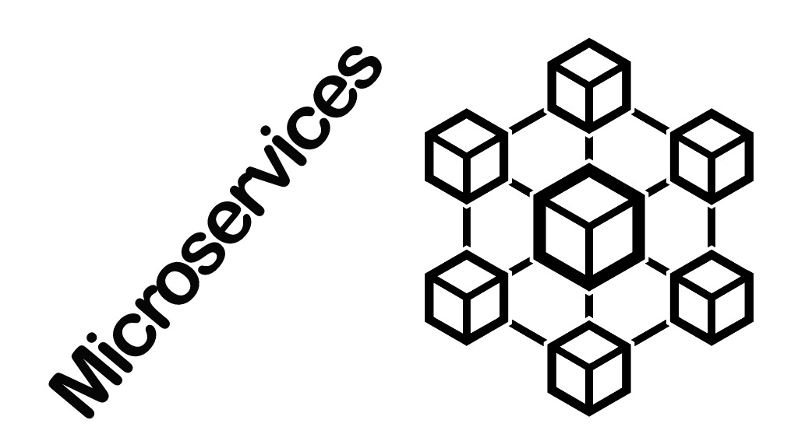

Geralmente quando quero aprender alguma tecnologia nova me faço três perguntas:

- O que é?
- Pra que serve?
- Quais são as características?

Se eu consigo responder essas três perguntas, já é um bom indício que entendendo o básico necessário desse assunto e posso passar pra outros conceitos técnicos ou tópicos teóricos mais avançados.

Antes de mais nada, talvez algumas pessoas ainda se perguntem "pra que eu preciso saber sobre isso?", bom, sem dúvidas microsserviços é um dos assuntos mais comentados hoje ***(05/04/2020)*** em todas ou quase todas comunidades de tecnologias voltadas para web, além de que as grandes empresas investem diariamente em geração de conteúdo, infra e metodologias em relação a arquitetura de microsserviços. Esse pra mim já são dois ótimos motivos pra ao menos entender bem o básico de microsserviços.

## O que é?

Um detalhe importante antes de responder a essa pergunta, é entender que não existe um manual universal ou um livro mágico sobre microsserviços, o que existe são fontes de conhecimento teórico e cases de sucesso que implementaram a arquitetura de microsserviços e publicaram seus resultados. Sabendo disso, é válido buscar fontes renomadas como o mestre Martin Fowler, Amazon, Microsoft, RedHat e outras.

Em praticamente todos os artigos ou posts sobre microsserviços existe uma explicação sobre a metodologia monolítica de se desenvolver software. Não vou me aprofundar nisso, deixarei todos os links de referência, mas basta saber de forma bem resumida que em um monolito comum todas as funcionalidades estão em uma aplicação única e que ficam em apenas um servidor.

Segundo [Martin Fowler e James Lewis](https://www.thoughtworks.com/pt/insights/blog/microservices-nutshell), ***"o estilo de arquitetura de microsserviços é uma abordagem que desenvolve um aplicativo único como uma suite de pequenos serviços, cada um executando seu próprio processo e se comunicando através de mecanismos leves, muitas vezes em uma API com recursos HTTP. Esses serviços são construídos em torno de capacidades de negócios e funcionam através de mecanismos de deploy independentes totalmente automatizados. Há o mínimo possível de gerenciamento centralizado desses serviços, que podem ser escritos em diferentes linguagens de programação e utilizam diferentes tecnologias de armazenamento de dados"***.

Já a [Amazon descreve da seguinte forma](https://aws.amazon.com/pt/microservices/): ***"Microsserviços são uma abordagem arquitetônica e organizacional do desenvolvimento de software na qual o software consiste em pequenos serviços independentes que se comunicam usando APIs bem definidas. Esses serviços pertencem a pequenas equipes autossuficientes***.
***As arquiteturas de microsserviços facilitam a escalabilidade e agilizam o desenvolvimento de aplicativos, habilitando a inovação e acelerando o tempo de introdução de novos recursos no mercado"***.

Já a [RedHat explica](https://www.redhat.com/pt-br/topics/microservices/what-are-microservices) ***"Microsserviços são uma abordagem de arquitetura para a criação de aplicações. O que diferencia a arquitetura de microsserviços das abordagens monolíticas tradicionais é como ela decompõe a aplicação por funções básicas. Cada função é denominada um serviço e pode ser criada e implantada de maneira independente. Isso significa que cada serviço individual pode funcionar ou falhar sem comprometer os demais"***.

Ainda seguindo com a RedHat, [em outro post](https://www.redhat.com/pt-br/topics/microservices/what-are-microservices) eles complementam sobre a arquitetura de microsserviços: ***"Os microsserviços são uma arquitetura e uma abordagem para escrever programas de software. Com eles, as aplicações são desmembradas em componentes mínimos e independentes. Diferentemente da abordagem tradicional monolítica em que toda a aplicação é criada como um único bloco, os microsserviços são componentes separados que trabalham juntos para realizar as mesmas tarefas. Cada um dos componentes ou processos é um microsserviço. Essa abordagem de desenvolvimento de software valoriza a granularidade, a leveza..."***.

Essas 4 definições, mesmo que diferentes tem grandes semelhanças. Todas falam da arquitetura de microsserviços como uma arquitetura de desenvolvimento de software, falam também sobre "decomposição" das funcionalidades de um sistema ou uma arquitetura, por exemplo, caso tivéssemos um sistema de lista de tarefas (To do list) em uma arquitetura monolítica e fossemos migrar para a arquitetura de microsserviços, provavelmente teríamos um microsserviço para usuários e outro para tarefas, independentes um do outro.

Então podemos concluir afirmando que um microsserviço é um software criado em uma abordagem/arquitetura que visa desmembrar as suas funcionalidades e fazer com que cada serviço/parte do sistema seja independente, visando a facilidade de manutenção, deploy, implementação de novas funcionalidas, além de leveza e independência dos times de desenvolvimento.

## Pra que serve?

Pegando um gancho do que já foi dito no tópico anterior, na grande maioria das vezes os microsserviços servem para reduzir a complexidade de manutenção, criação de novas funcionalidades, gerenciamento de equipes de desenvolvimento, melhorar a escalabilidade e prover independência de linguagens e tecnologias dentro de um contexto ou serviço dentro de uma arquitetura.

## Quais são as características?

Algumas características importantes sobre microsserviços e que são frequentemente abordados, são:

- Independência
- Escalabilidade
- Manutenção

### Independência

Imagine que tenhamos 7 programadores, 4 são bons em Elixir, 3 são bons em Javascript e vamos migrar nosso sistema de lista de tarefas para a arquitetura de microsserviços. Analisando os logs e dados da nossa aplicação, percebemos que a carga sobre o contexto das tarefas é bem mais pesado que nos usuários, então decidimos dividir os 7 programadores em duas equipes.

A primeira equipe ficará responsável pelos usuários, essa equipe ficará com os 3 programadores bons em Javascript e será responsável por toda a parte de inscrição, autenticação e autorização.

A segunda equipe ficará responsável por todo o contexto das tarefas e será composta pelos 4 programadores que são bons em Elixir, já que é uma linguagem focada em desempenho e a carga em cima das tarefas é bem maior que nos usuários.

Cada equipe agora trabalhará em um servidor, em um repositório específico e com linguagens de programação e tecnologias diferentes, um servidor pode estar na Amazon e outro na Digital Ocean por exemplo. Agora temos dois contextos/serviços, o contexto usuários e o contexto tarefas que juntos formam um sistema de tarefas e que agora é baseado na arquitetura de microsserviços.

Resumindo, temos independência de servidores, de tecnologias e de equipes.

### Escalabilidade

Utilizando o mesmo contexto anterior, imagine que o contexto de usuários começa a receber uma carga fora do normal, o servidor começa a falhar e dar timeout nas requisições porque está com 100% de memória e processamento utilizados, então a equipe decide escalar verticalmente o servidor, ou seja, adicionar mais memória e poder de processamento.

O servidor fica estável e depois de 24 horas a carga diminui, agora o servidor está trabalhando com apenas 10% de sua capacidade, então a equipe mais uma vez decide alterar as propriedades de processamento do servidor, dessa vez reduzindo pra manter o custo médio definido pela empresa para aquele servidor.

Então, perceba a praticidade em escalar apenas um determinado contexto do sistema. O servidor/microsserviço de usuários escalou e depois retornou a sua configuração anterior sem que o servidor/microsserviço de tarefas fosse afetado, esse é um dos bons exemplos de escalabilidade utilizando microsserviços, conseguimos direcionar o foco para pontos específicos dentro da arquitetura sem afetar os demais microsserviços.

### Manutenção

Quando falamos de manutenção em microsserviços podemos dividir em vários fatores, por exemplo:

- Criação de novas funcionalidades
- Deploy contínuo (CD)
- Integração contínua (CI)

Utilizando o mesmo contexto de um sistema de lista de tarefas, imagine que agora vamos adicionar autenticação em apis de terceiros ao microsserviço de usuários, pode ser via Google, Facebook, Github e etc. Se fosse em um padrão monolítico, a probabilidade disso afetar ou quebrar algo nas tarefas é enorme. Em um sistema convencional estaríamos tratando de um relacionamento entre objetos User -> Task por exemplo.

Já com a arquitetura de microsserviços, a equipe responsável pelo contexto dos usuários fica responsável por implementar essa nova funcionalidade e a probabilidade disso afetar o microsserviço de tarefas é reduzido drasticamente.

Automaticamente isso afeta o ciclo de deploys da aplicação. Por exemplo, se estivéssemos tratando de um campo adicionado ao usuário que precisasse ser migrado de uma api ou de um arquivo CSV por exemplo, o processo de deploy e de migração desses dados seria provavelmente um processo mais doloroso do que na arquitetura de microsserviços por se tratar de contextos/servidores diferentes.

Agora pense na integração contínua, no Github está definido no nosso monolito que apenas podemos fazer merge de uma Pull Request na branch Development primeiro e depois criamos uma nova Pull Request para o Master quando a CI estiver passando. Nada demais até aqui, mas imagine que nosso monolito possua 10 mil testes e que cada Pull Request gera uma nova verificação na CI, prepare-se para esperar no mínimo alguns minutos em cada PR, isso se a CI não estiver ligada nos commits também.

Agora migrando para a arquitetura de microsserviços, digamos que 3 mil testes irão para o repositório e CI do microsserviço de usuários e 7 mil para o microsserviço de tarefas, provavelmente o tempo de execução de cada integração contínua cairá de forma considerável.

## Conclusão

É isso, podemos nos referir aos microsserviços de duas formas. A primeira é falar diretamente de um microsserviço, ou seja, um serviço/contexto que é responsável por determinadas funcionalidades dentro de um sistema baseado na arquitetura de microsserviços. A segunda é falar diretamente da arquitetura de microsserviços, que é uma arquitetura formada por vários conceitos e metodologias como independência, escalabilidade, manutenção e outros que vimos nesse post.

É isso.