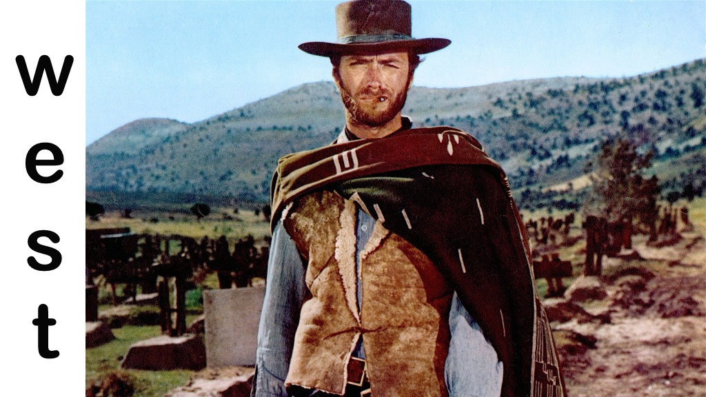

Eu cresci sob a influência de meu pai assistindo filmes de faroeste (bang-bang como alguns falavam). Nomes como Clint Eastwood, Franco Nero e Robert Woods são conhecidos por mim até hoje. Infelizmente a maior parte das novas gerações nunca assistirá ou entenderá o quão bons eram esses filmes e todos os clichês do cinema da época. 

O detalhe que me faz gostar até hoje desses filmes sem dúvidas é a ambientação, que nos faz pensar em como as pessoas sobreviviam em um lugar tão hostíl e perigoso quanto o velho oeste. É comum os protagonistas estarem arrodeados de bandidos, fome, sede, falta de higiêne, além do sol escaldante do deserto. Mesmo assim, o instinto de sobrevivência dividia o espaço igualmente com a sede por justiça, humildade e ajuda ao próximo.

O termo faroeste no Brasil e em Portugual vem da fronteira do Oeste americano que durante a colonização era chamada de "Far West" (Extremo oeste). As maiores fontes desse tipo de filme foram os Estados Unidos que produziam os seus "westerns" e a Itália com o seu "western spaghetti". Os filmes mais conhecidos desse segmento estão nas décadas de 60 e 70.

Então, com essa introdução vamos a lista.

## Três homens em conflito, O bom, o mau e o feio.

- Título original: The good the bad and the uggly
- Ano de lançamento: 1966
- Ano de lançamento no Brasil: 1968
- Elenco principal: Clint Eastwood, Lee Van Cleef, Eli Wallach
- Trilha sonora: Ennio Morricone

<iframe src='https://www.youtube.com/embed/El5N9z7t3DM' frameborder='0' allowfullscreen></iframe>

Além disso, esse filme conta com umas das mais icônicas trilhas sonoras de todos os tempos criada por ninguém menos que Ennio Morricone. Você pode conferir uma ótima apresentação das músicas The good the bad and the uggly e The ecstasy of Gold que mais tarde seria interpretada pela banda Metallica:

<iframe src='https://www.youtube.com/embed/enuOArEfqGo' frameborder='0' allowfullscreen></iframe>
