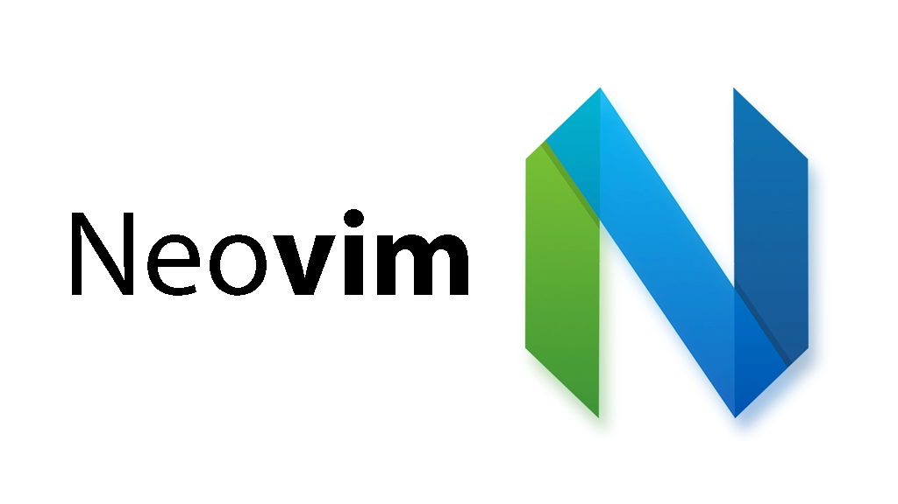

Pra quem não conhece, o Neovim é um fork do Vim, o famoso e "milenar" editor de textos utilizado tanto por profissionais de infra que configuram distros Linux em nível hard até programadores front-end que usam React ou Vue e suas infinitas ferramentas.

Não vou falar sobre curva de aprendizado nesse post, a mensagem a ser passada aqui é: Instale, quebre a cabeça e aprenda a utilizar o Neovim.

## Instalando

Caso não possua ainda o Neovim instalado, no MacOS é bem fácil utilizando o Homebrew:

```sh
brew install neovim
```

## Configurações

O arquivo principal de configuração é por padrão o ***init.vim***, que podemos criar no seguinte local:

```
~/.config/nvim/init.vim
```

### Exibindo número das linhas

Para exibir as linhas do arquivo basta adicionar:

```vim
set number
```

Para que as alterações surtam efeito, o arquivo de configuração deve ser recarregado, dentro do Neovim pode ser carregado através do comando:

```sh
:source ~/.config/nvim/init.vim
```

### Instalando plugins com Vim-Plug

O [Vim-Plug](https://github.com/junegunn/vim-plug) sem dúvidas é um dos melhores gerenciadores de plugins para o Neovim, neste post vamos utiliza-lo.

Para instalar o Vim-Plug no MacOS, basta executar o seguinte comando:

```sh
curl -fLo ~/.local/share/nvim/site/autoload/plug.vim --create-dirs \
    https://raw.githubusercontent.com/junegunn/vim-plug/master/plug.vim
```

Lembrando que na página do Github podem ser encontradas as outras formas de instalação para outros SO.

#### Configuração básica do Vim-Plug

Voltando ao arquivo init.vim:

```
" Vim-Plug Config
call plug#begin('~/.vim/plugged')

Plug 'scrooloose/nerdtree'

call plug#end()

set number
```

Nesse caso, dentro do begin/end do Vim-Plug ficarão os plugins que precisamos, adicionei o nerdtree que é um plugin para exibir os arquivos da pasta atual na lateral da tela.

Para instalar os plugins adicionados ao arquivo init.vim, dentro do Neovim podemos executar o comando:

```
:PlugInstall
```

### Criando arquivos

Com o Nerdtree instalado, podemos criar arquivos através da janela lateral ou podemos apenas executar no Neovim:

```
:touch meuarquivo.js
```

No Nerdtree, digite ***m*** e uma janela com opções será exibida, a opção ***a*** permite adicionar um novo arquivo.

## Comandos básicos

A grande sacada do Vim/Neovim é criar comandos que facilitem a rotina de cada usuário, nesse caso, cada programador. Mas o Vim/Neovim já possui uma quantidade gigante de comandos que por padrão já tornam a vida mais fácil, é só esquecer por enquanto que os mouses existem. =)

| Comando | Função                    |
|---------|---------------------------|
| :v      | Modo visual               |
| :i      | Modo insert               |
| :q      | Sair                      |
| :q!     | Forçar Sair               |
| :w      | Salvar                    |
| :w!     | Forçar Salvar             |
| :split  | Divide tela na horizontal |
| s       | utilizando NERDTree       |
| :vsplit | Divide tela na vertical   |
| i       | utilizando NERDTree       |
| :tabnew | Nova tab                  |


### Navegação

A primeira regra da navegação no Vim é: Esqueça o seu mouse. A grande sacada é que ações comuns em editores como Sublime, Atom e VSCode também sejam no Vim pra que o período de transição não precise ser doloroso.

| Comando   | Função                                |
|-----------|---------------------------------------|
| k         | Ir para linha de cima                 |
| j         | Ir para a linha de baixo              |
| l         | Ir para a direita                     |
| h         | Ir para esquerda                      |
| e         | Ir para o fim da palavra atual        |
| w         | Ir para a próxima palavra             |
| b         | Ir para a palavra anterior            |
| }         | Ir para o próximo parágrafo           |
| {         | Ir para o parágrafo anterior          |
| $         | Ir para o fim da linha                |
| 0         | Ir para o começo da linha             |
| gg       | Ir para o começo do arquivo           |
| G         | Ir para o fim do arquivo              |
| M         | Ir para o meio da tela atual          |
| H         | Ir para o início da tela atual        |
| L         | Ir para o fim da tela atual           |
| CTRL + ww | Alterna entre janelas na tela atual   | 

### Edição

Outra coisa muito útil do Vim são os comandos de edição e navegação+edição. Segue outra tabela de comandos úteis.

| Comando | Função                                |
|---------|---------------------------------------|
| o       | Abrir nova linha em modo Insert       |
| A       | Ir para o fim da linha em modo Insert |
| dd      | Excluir linha                         |
| yy      | Copiar linha                          |
| p       | Colar                                 |
| :u      | Desfazer                              |

## Mapeando atalhos

Retornando ao arquivo principal de configuração (init.vim), vamos otimizar nossa rotina de escrever código criando atalhos dentro do Neovim.

### Leader Key

O primeiro passo é criar uma leader key, ou uma tecla específica para combinar com outras teclas e criar nossos atalhos, atualmente uso a vírgula do teclado como leader key, mas já usei também a barra de espaço, isso fica totalmente a seu critério, para definir a leader basta acrescentar ao init.vim:

```
let mapleader=','
```

### Mapeando comandos de Plugins

Agora pra utilizar a leader key, podemos testar com o NERDTree. O comando NERDTreeToggle abre ou fecha a janela lateral dos arquivos, vamos mapear um atalho para executar esse comando sempre que digitado:

```
nmap <leader>/ :NERDTreeToggle<CR>
```

Então, dessa forma estou "ensinando" ao meu Neovim que toda vez que eu digitar minha leader key (,) e em seguinda digitar barra (/), quero que ele execute o comando :NERDTreeToggle, para abrir ou fechar a janela lateral de arquivos, o <CR> do final indica ao vim para confirmar a ação, como se apertasse a tecla ENTER.

### Mapeando comandos do Vim

Outro exemplo, podemos mapear uma tecla específica que em conjunto da leader key possa salvar o arquivo atual sem precisar digitar ESC + :w toda vez, então podemos adicionar ao arquivo init.vim:

```
nmap <leader>s :w<CR>
```

Então, fica definido que toda vez que a leader key (,) for apertada e seguida da letra s, o Neovim executa o comando :w + ENTER para salvar o arquivo.

## Mudando o tema

Sim, podemos modificar facilmente o tema do Neovim como em outros editores e uma coisa legal é que a maioria dos temas encontrados para o VSCode por exemplo, também são encontrados para o Neovim.

Nesse caso, vamos utilizar o famoso tema Molokai.

### Adicionando novo Plugin/Tema

O tema também é um Plugin, portanto voltamos ao Vim-Plug e suas configurações para adicionar o Molokai, dentro do begin e end no arquivo init.vim:

```
Plug 'tomasr/molokai'
```

Dentro do Neovim instalamos o Plugin:

```
:PlugInstall
```

Agora podemos definir o Molokai como tema padrão, fora do begin e end do Vim-Plug:

```
colorscheme molokai
set background=dark
```

### Fonte e tamanho do texto

Também é muito comum modificar a fonte do editor conforme mais nos agrade, portanto basta acrescentar ao init.vim:

```
set guifont=Fira\ Code:h16
```

No caso, estou utilizando a fonte Fira Code no tamanho 16.

## Dicas de plugins

Um site bem famoso e ótimo para buscar plugins do Vim/Neovim é o [VimAwesome](https://vimawesome.com/), retirada dele, deixo uma lista de plugins que já utilizei ou utilizo no meu Neovim.

| Plugin                  | Função                                                           |
|-------------------------|------------------------------------------------------------------|
| vim-airline/vim-airline | Barra de status com várias informações                           |
| sheerun/vim-polyglot    | Identifica várias linguagens diferentes                          |
| jiangmiao/auto-pairs    | Fecha automaticamente pares como aspas, colchetes, chaves e etc. |

## Conclusão

O arquivo init.vim final fica da seguinte forma:

```
" Vim-Plug Config
call plug#begin('~/.vim/plugged')

Plug 'scrooloose/nerdtree'
Plug 'tomasr/molokai'
Plug 'vim-airline/vim-airline'
Plug 'sheerun/vim-polyglot'
Plug 'jiangmiao/auto-pairs'

call plug#end()

colorscheme molokai
set background=dark
set guifont=Fira\ Code:h16
set number
let mapleader=','
nmap <leader>/ :NERDTreeToggle<CR>
nmap <leader>s :w<CR>
```

O Neovim não é um bicho de 7 cabeças, basta investir algumas horas definindo os atalhos que sejam mais úteis para você e decorar alguns comandos básicos. É isso.
